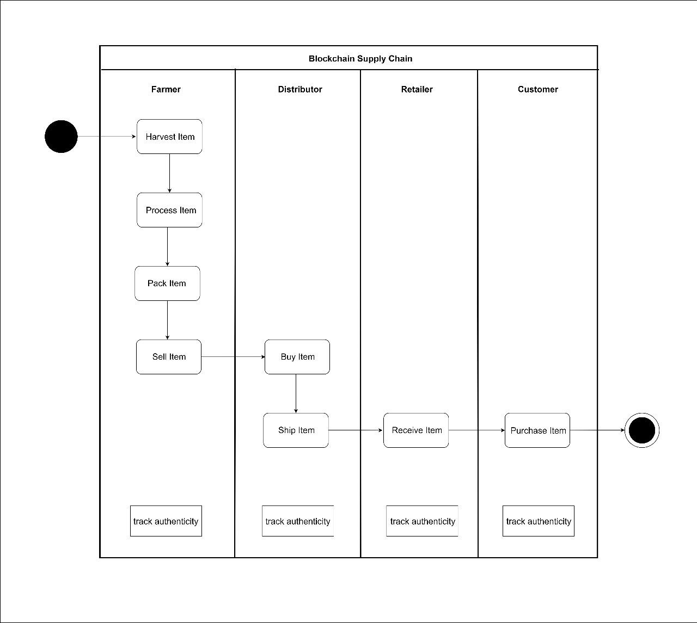
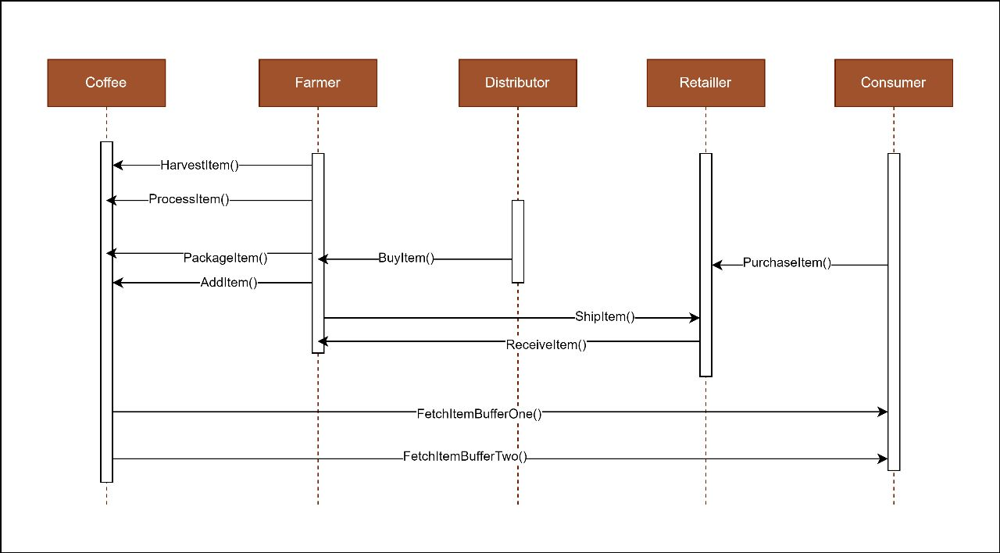
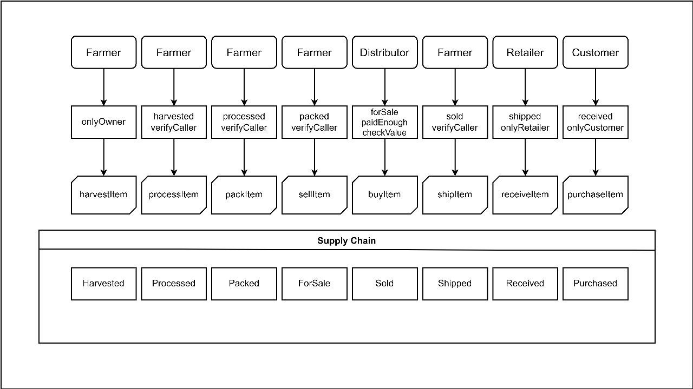
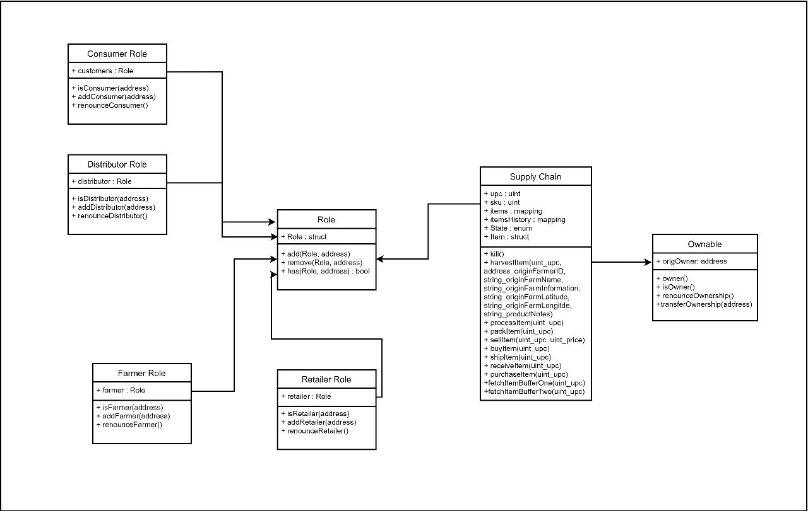

# SimpleSupplyChain

Dillinger is a cloud-enabled, mobile-ready, offline-storage compatible,
AngularJS-powered HTML5 Markdown editor.

- Truflle Version is 4.1.14
- Web3 v1.2.1
- ✨Node v16.13.2

- Activity Diagram

- Sequence Diagram

- State Diagram

- Class Diagram

## Some Lib

Library:

- truffle-assertions - Used this to originally get the events to fire, don't think it is needed because I found a code snipped to raise the events.
- truffle/hdwallet-provider - HD Wallet-enabled Web3 provider. Use it to sign transactions for addresses derived from a 12 or 24 word mnemonic.

## Address

Deployed Contract Address

| Name | Address |
| ------ | ------ |
| Migrations | [plugins/dropbox/README.md][PlDb] |
| FarmerROle | [plugins/github/README.md][PlGh] |
| DistributorRole | [plugins/googledrive/README.md][PlGd] |
| RetailerROle | [plugins/onedrive/README.md][PlOd] |
| ConsumerROle | [plugins/medium/README.md][PlMe] |
| Supplychain | [plugins/googleanalytics/README.md][PlGa] |
